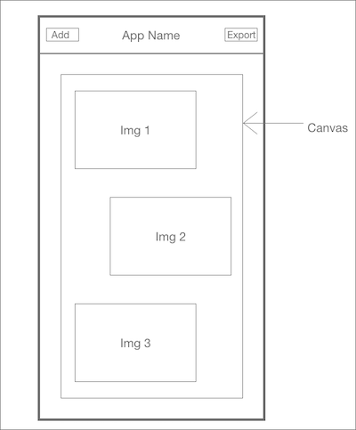

# Simple Photo Collage Maker

## Goal
The goal is to create a simple photo collage maker applicaiton on mobile with basic functionalities.

## Features
This application should have following features:
- There should be a 9:16 aspect ratio canvas over which all the photos will be placed.
- User should be able to select multiple photos from his photo library and place it on canvas.
- User should be able to delete a photo from the canvas.
- User should be able to drag, rotate and scale individual photos from the canvas.
- Export the final collage image to user's photo album.

## Bonus Features
Candidate will get bonus marks for following features:
- Applying filters to individual image.
- Adding / removing text on the collage.
- Export a 3 second video of the image.

## Reference Wireframe
Following is a reference wireframe for the app:

You have complete liberty to modify the UI. Above wireframe is just for a reference.

## Deliverables
- Candidate is expected to submit and Xcode project via GitHub.
- Project should be built using UIKit.
- Including a README would be nice to have describing how to use the application.